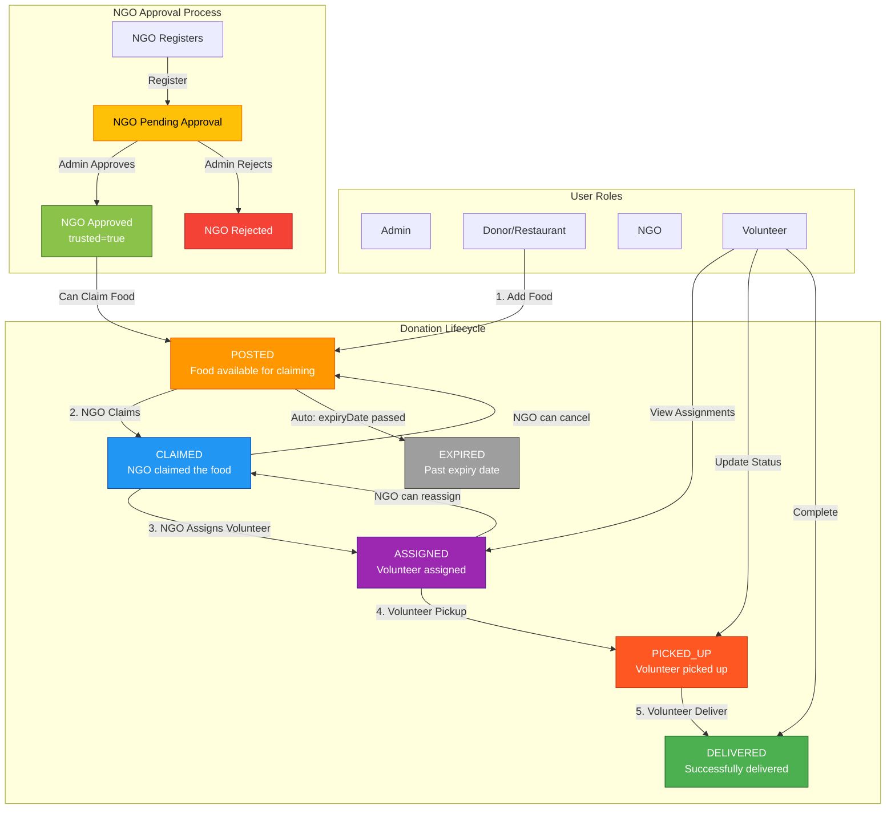

# Smart Food Donation Platform - Complete Workflow

## System Architecture & Workflow Diagram



## Detailed State Transitions

| Current State | Action | Next State | Actor | Validation |
|--------------|--------|-----------|-------|------------|
| - | Add Food | POSTED | Donor | Valid food data |
| POSTED | Claim | CLAIMED | NGO (trusted) | Status=POSTED, NGO approved |
| POSTED | Auto Expire | EXPIRED | System | expiryDate < today |
| CLAIMED | Assign Volunteer | ASSIGNED | NGO | Status=CLAIMED, volunteer exists |
| CLAIMED | Cancel | POSTED | NGO | Status=CLAIMED |
| ASSIGNED | Pickup | PICKED_UP | Volunteer | Status=ASSIGNED, assigned volunteer only |
| ASSIGNED | Reassign | CLAIMED | NGO | Remove volunteer |
| PICKED_UP | Deliver | DELIVERED | Volunteer | Status=PICKED_UP, assigned volunteer only |

## API Endpoints by Role

### Donor/Restaurant (RESTAURANT)
- `POST /restaurant/add-food` - Add new food donation
- `GET /restaurant/food-list` - View my posted food
- `GET /restaurant/pending-claims` - View pending claims on my food
- `PUT /restaurant/approve-claim/{claimId}` - Approve a claim (optional workflow)
- `PUT /restaurant/reject-claim/{claimId}` - Reject a claim

### NGO (NGO)
- `GET /food/available` - View available food (POSTED status)
- `POST /food/claim/{foodId}` - Claim food (requires trusted=true)
- `GET /food/my-claims` - View my claimed food
- `PUT /volunteer/donations/{donationId}/assign/{volunteerId}` - Assign volunteer to delivery

### Volunteer (VOLUNTEER)
- `GET /volunteer/my-assignments` - View my delivery assignments
- `PUT /volunteer/donations/{donationId}/pickup` - Mark as picked up
- `PUT /volunteer/donations/{donationId}/deliver` - Mark as delivered

### Admin (ADMIN)
- `GET /admin/pending-ngos` - View NGOs awaiting approval
- `PUT /admin/approve-ngo/{ngoId}` - Approve NGO (sets trusted=true)
- `PUT /admin/reject-ngo/{ngoId}` - Reject NGO
- `GET /admin/stats` - View platform statistics

## Database Schema

### Users Table
```sql
CREATE TABLE users (
    id BIGINT PRIMARY KEY AUTO_INCREMENT,
    name VARCHAR(255) NOT NULL,
    email VARCHAR(255) UNIQUE NOT NULL,
    password VARCHAR(255) NOT NULL,
    role ENUM('RESTAURANT', 'NGO', 'ADMIN', 'VOLUNTEER') NOT NULL,
    trusted BOOLEAN DEFAULT FALSE,
    created_at TIMESTAMP DEFAULT CURRENT_TIMESTAMP
);
```

### Food Items Table
```sql
CREATE TABLE food_items (
    id BIGINT PRIMARY KEY AUTO_INCREMENT,
    restaurant_id BIGINT NOT NULL,
    volunteer_id BIGINT NULL,
    name VARCHAR(255) NOT NULL,
    quantity VARCHAR(255) NOT NULL,
    expiry_date DATE NOT NULL,
    status ENUM('POSTED', 'CLAIMED', 'ASSIGNED', 'PICKED_UP', 'DELIVERED', 'EXPIRED') DEFAULT 'POSTED',
    created_at TIMESTAMP DEFAULT CURRENT_TIMESTAMP,
    FOREIGN KEY (restaurant_id) REFERENCES users(id),
    FOREIGN KEY (volunteer_id) REFERENCES users(id)
);
```

### Claims Table
```sql
CREATE TABLE claims (
    id BIGINT PRIMARY KEY AUTO_INCREMENT,
    food_item_id BIGINT NOT NULL,
    ngo_id BIGINT NOT NULL,
    claim_date TIMESTAMP DEFAULT CURRENT_TIMESTAMP,
    status ENUM('PENDING', 'APPROVED', 'REJECTED') DEFAULT 'APPROVED',
    approved_date TIMESTAMP NULL,
    rejection_reason TEXT NULL,
    FOREIGN KEY (food_item_id) REFERENCES food_items(id),
    FOREIGN KEY (ngo_id) REFERENCES users(id)
);
```

## Security & Role Access Matrix

| Endpoint | RESTAURANT | NGO | VOLUNTEER | ADMIN |
|----------|-----------|-----|-----------|-------|
| /restaurant/** | ✓ | ✗ | ✗ | ✗ |
| /food/available | ✓ | ✓ | ✗ | ✓ |
| /food/claim/** | ✗ | ✓ (trusted) | ✗ | ✗ |
| /food/my-claims | ✗ | ✓ | ✗ | ✗ |
| /volunteer/donations/**/assign/** | ✗ | ✓ | ✗ | ✗ |
| /volunteer/donations/**/pickup | ✗ | ✗ | ✓ (assigned) | ✗ |
| /volunteer/donations/**/deliver | ✗ | ✗ | ✓ (assigned) | ✗ |
| /volunteer/my-assignments | ✗ | ✗ | ✓ | ✗ |
| /admin/** | ✗ | ✗ | ✗ | ✓ |

## Key Business Rules

1. **NGO Approval Required**: NGOs must be approved by Admin (trusted=true) before claiming food
2. **Status Transitions**: Food items follow strict state machine - no skipping states
3. **Volunteer Assignment**: Only NGOs can assign volunteers to their claimed food
4. **Pickup/Delivery**: Only the assigned volunteer can update pickup/delivery status
5. **Auto-Expiration**: System automatically expires food items past their expiryDate
6. **Role Validation**: Every API endpoint validates user role before processing
